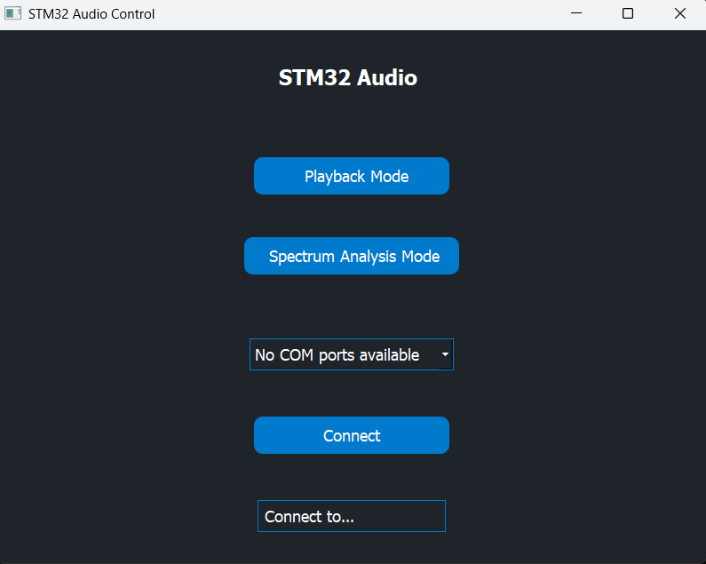

# Audio Decimation and FFT Analyzer on STM32F407 Discovery

## Project Overview
This project implements an audio processing application on the STM32F407 Discovery board. The key features include:

- **PDM to PCM Decimation**: Conversion of microphone PDM data to PCM format.
- **FFT Audio Analysis**: Real-time frequency analysis of the audio signal.

The application leverages the STM32F407’s capabilities, such as its DSP instructions and PDM microphone input, to process and analyze audio signals.

---

## Features

### 1. PDM to PCM Conversion
- The STM32F407 Discovery board includes a PDM microphone. The PDM signal is converted into PCM using:
  - A decimation filter.
  - Low-pass filtering to reconstruct the audio signal.
- The decimation and filtering processes are optimized for real-time performance.

### 2. FFT Audio Analyzer
- The FFT (Fast Fourier Transform) is used to analyze the frequency spectrum of the PCM audio signal.
- Key features:
  - Real-time visualization of audio frequencies.
  - Configurable FFT size (e.g., 256, 512, or 1024 points).
  - Scaled amplitude to identify dominant frequencies in the signal.

---

## Implementation Details

### Hardware Setup
- **STM32F407 Discovery Board**: Used for signal processing.
- **PDM Microphone**: Built-in on the board for audio input.
- **USB or UART**: To output FFT results or debug logs.

### Software Modules
- **PDM Decimation Module**:
  - Converts PDM data from the microphone to PCM data.
  - Configured using STM32 HAL (Hardware Abstraction Layer).
  - Uses FIR filters for decimation.

- **FFT Module**:
  - Implements the Cooley-Tukey FFT algorithm using CMSIS-DSP.
  - Processes PCM data to calculate frequency components.

- **Display or Debugging Interface**:
  - Outputs FFT data over UART or USB.
  - Displays frequency spectrum if connected to a GUI or terminal application.

### Workflow Overview

Data Acquisition and Processing Workflow

PDM Signal Acquisition:

PDM data is acquired from the microphone using DMA.

The DMA callbacks transfer the PDM data to the PDM task via a FreeRTOS queue.

PDM to PCM Conversion:

The PDM task performs decimation and filtering to convert the PDM data into PCM data.

FFT Processing:

The PCM data is passed to the FFT task through a queue.

The FFT task calculates the frequency components using the CMSIS-DSP library.

Output to Python Interface:

The FFT results are sent via USB to a Python-based interface for real-time visualization.


---

## How to Build and Run

### Prerequisites
- **Hardware**: STM32F407 Discovery board.
- **Software**:
  - STM32CubeIDE or Keil uVision.
  - CMSIS-DSP library.
  - STM32 HAL drivers.

### Steps
1. Clone the repository:
   ```bash
   git clone <repository-url>

```

---

## Testing the Demo with the Audio GUI

### Audio GUI Overview

A cross-platform graphical interface is provided to control and visualize the STM32 Audio Demo.
**Home of the GUI interface:**
`audio_gui/` (navigate to this directory for the GUI source or executable)



### How to Use the Audio GUI

1. **Build and Flash the Firmware**
   - Follow the standard build and flash instructions for your STM32F407 board.

2. **Connect the Board**
   - Plug the STM32F407 Discovery board into your PC via USB.
   - Wait for the device to enumerate (USB CDC).

3. **Launch the Audio GUI**
   - Navigate to the `audio_gui` directory.
   - Run the GUI application (e.g., `python main.py` if it’s Python-based, or double-click the executable if provided).

4. **Select the Serial Port**
   - In the GUI, select the correct COM port corresponding to your STM32 device.
   - If no COM ports are available, check your USB connection and drivers.

5. **Choose Operation Mode**
   - Click **Playback Mode** to test audio playback.
   - Click **Spectrum Analysis Mode** to visualize FFT results in real time.

6. **Connect**
   - Press the **Connect** button to establish communication.
   - The status will update, and the GUI will display real-time data from the STM32.

7. **Interact**
   - Use the GUI controls to switch modes, start/stop analysis, or view live spectrum data.

### Troubleshooting

- **No COM Port Detected:**  
  Ensure the STM32 is properly flashed and connected. Try reconnecting the USB cable or restarting the GUI.
- **No Data Displayed:**  
  Make sure the STM32 is running the correct firmware and that the mode is selected via the GUI.

---

**Note:**  
For more details about the GUI, see the `audio_gui/README.md` or the documentation inside the `audio_gui` folder.
